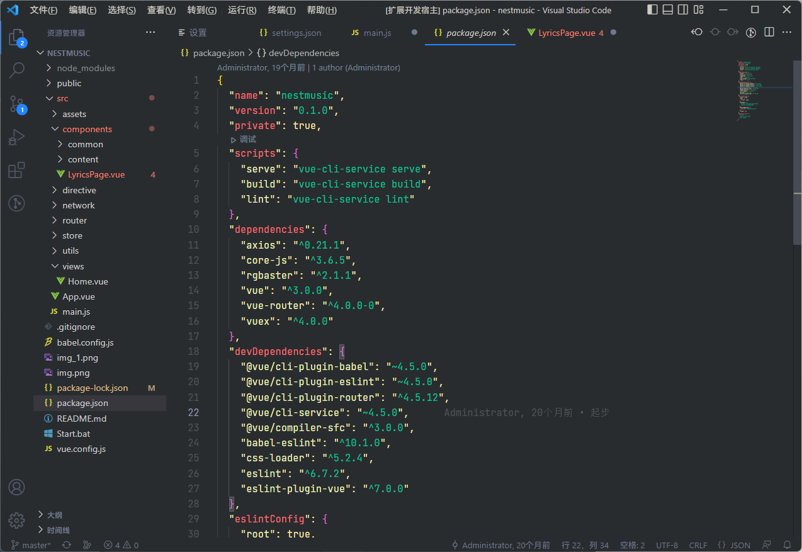

<!--
 * @Author: Levampire 2867166044@qq.com
 * @Date: 2022-12-01 12:49:55
 * @LastEditors: Levampire 2867166044@qq.com
 * @LastEditTime: 2022-12-02 17:31:05
 * @FilePath: \Levampire\README.md
 * @Description: 这是默认设置,请设置
-->
## ButterTheme for Visual Studio Code
<center> </center>
<center><H1> Butter Dark Theme<H1></center>

> ButterTheme, A Visual Studio Code dark theme plug-in.

## Installation

Install from marketplace 

HTML Style


CSS Style


JS Style


Json Style



## Change Fonts

Change fonts to fix windows default font (Microsoft Yahei) rendering burr.

* open setting.json
* add config code
* DownLoad JetBrains Mono form [OfficeWebsite](https://www.jetbrains.com/lp/mono/)

```json
 {
    "editor.fontFamily": "JetBrains Mono, Consolas, 'Courier New', monospace",
    "editor.fontSize": 14,
    "editor.lineHeight": 1.6,
 }
```

**Enjoy!**
